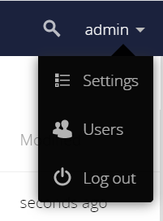
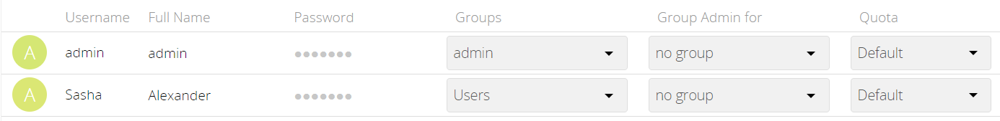

# ownCloud Server – Quick Start Guide

The instructions below describe the quickest way of installation and initial configuration of a fully functional ownCloud server. This method uses Docker—software that packages an application and its dependencies in virtual containers that can run on any operating system. To enable this method, ownCloud maintains a [Docker container](https://hub.docker.com/r/owncloud/server/tags) for the ownCloud server, which can be bundled with the required databases using the Docker Compose tool.

## System Requirements

ownCloud needs at least 128 MB of RAM, but we recommend a minimum of 512 MB. The actual memory use of an ownCloud server depends on the number of users and files, and how active the server is.

## Prerequisites

- Linux terminal

    Although Docker containers can be run on any operating system, this set of instructions assumes that the machine has a Linux terminal. 
- Docker Compose

    Your machine should have the Docker software including Docker Compose installed. Refer to the [Docker website](https://docs.docker.com/get-docker/) for the installation instructions.

## Installation

**To install an ownCloud server, do the following:**

1. Open the Linux terminal. If needed, change the directory to the one in which you want to install ownCloud.
2. Create a new project directory:
    ```
    mkdir $OWN_CLOUD_DIR_NAME
    cd $OWN_CLOUD_DIR_NAME
    ```
3. Download the ownCloud `docker-compose.yml` into the current directory.
    ```    
    wget https://raw.githubusercontent.com/owncloud/docs/master/modules/admin_manual/examples/installation/docker/docker-compose.yml
    ```
1. Create a `.env` configuration file that contains the required configuration parameters. Set the parameters as follows:

- `$DOMAIN_NAME`: 

    For a local installation: `localhost:8080`

    For remote access:  `{domain name}:8080` or `{IP address}:8080`

- `$USERNAME` - admin's username

- `$PASSWORD` - admin's password


    ```
    cat << EOF > .env
    OWNCLOUD_VERSION=latest
    OWNCLOUD_DOMAIN=$DOMAIN_NAME
    ADMIN_USERNAME=$USERNAME
    ADMIN_PASSWORD=$PASSWORD
    HTTP_PORT=8080
    EOF
    ```


    **Note** : `ADMIN_USERNAME` and `ADMIN_PASSWORD` will not change between deployments even if you change the values in the .env file. To change them, you will have to run `docker volume prune`, which **will delete all your data**.

1. Start the containers:
    ```
    docker-compose up -d
    ```
1. When the process is completed, check that all the containers have successfully started by running `docker-compose ps`.

    The output shows that all containers are up and ownCloud is accessible via port `8080` on the host machine.

       

**Note** : Although the containers are up and running, it may still take a few minutes until ownCloud is fully functional. To know exactly when you may start using the server, run `docker-compose logs --follow owncloud` and inspect the log output. When the output shows "Starting apache daemon...", you may access the web UI.

## Logging In

**To log in to the ownCloud UI:**

1. Open [http://localhost:8080](http://localhost:8080/) in your browser of choice.

    The ownCloud login screen opens.

    

1. Enter the admin username and password that are stored in the `.env` file. Click the arrow.

    The ownCloud UI opens.

    

## Adding a User

**To create a new user of the ownCloud server, do the following:**

1. Open the **Admin** drop-down menu in the upper left corner of the screen and select **Users**.   

      

    The **Users** screen opens.

    

2. Enter the new user's username and email address.

    
   
   
    Usernames may contain lowercase and uppercase letters, numbers, dashes, underscores, periods and @ signs.

    Optionally, to assign the new user to a group, select the group from the **Groups** drop-down menu.

3. Click the ***Create*** button.

    The new user is added to the list of existing users.
 
    You may fill in the user's full name if it is different from the username

4. Set a password for the new user:

    1. Hover the cursor over the new user's **Password** field.
    2. Click on the pencil icon.
    3. Type in the user's new password and press ***Enter***.
 

1. To enable the new user to use the ownCloud server, provide them with the following information:

    - Address for accessing the ownCloud UI: `{domain name}:8080` or `{IP address}:8080` (same as in the `.env` configuration file)
    - Username
    - Password

    Instruct the user that the UI of the ownCloud server can be accessed by opening the provided address in any browser and entering the login credentials.

