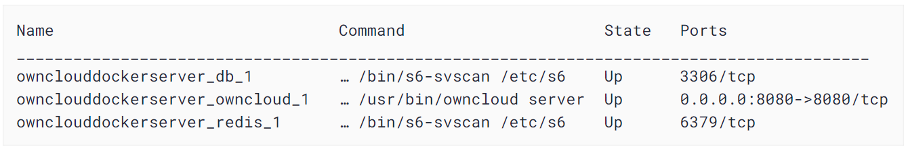
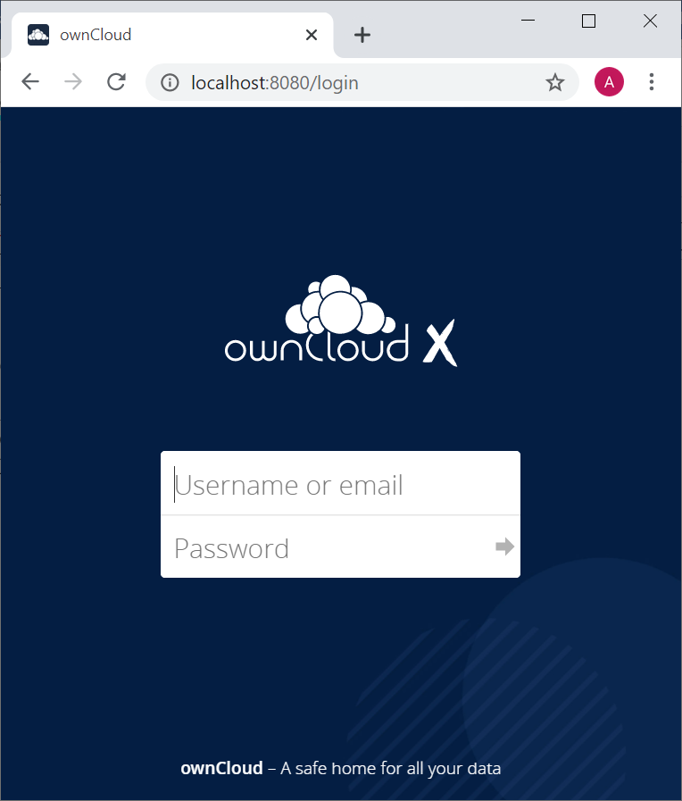
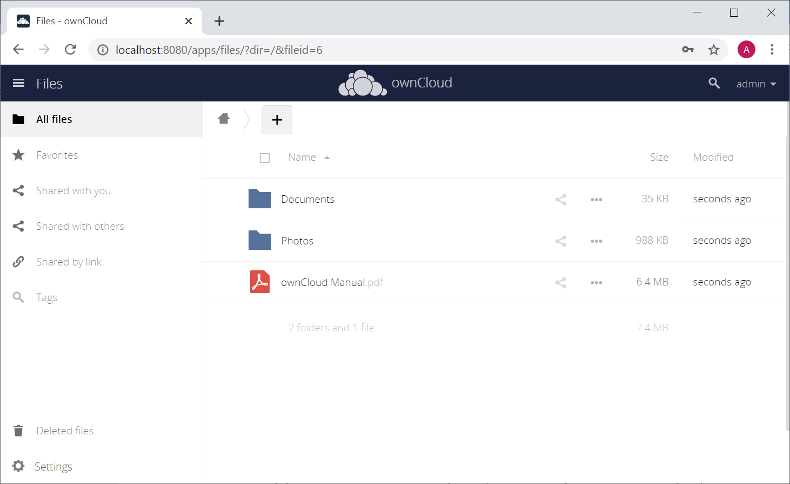
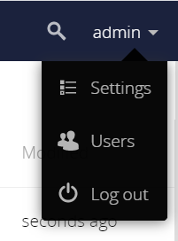
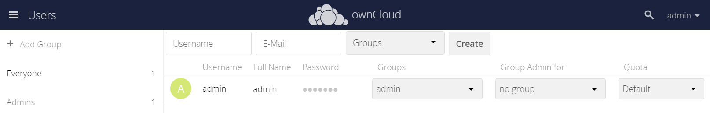
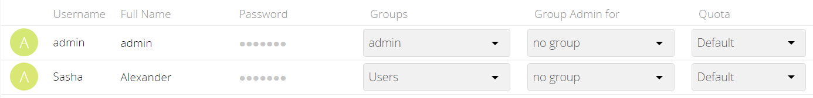
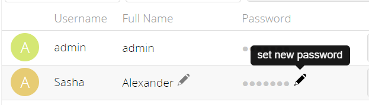

# ownCloud Server – Quick Start Guide

The instructions below describe the quickest way of installation and initial configuration of a fully functional ownCloud server. This method uses Docker—software that packages an application and its dependencies in a virtual container that can run on any operating system. To enable this method, ownCloud maintains [its Docker container](https://hub.docker.com/r/owncloud/server/tags) available for installation.

# System Requirements

ownCloud needs at least 128 MB of RAM, but we recommend a minimum of 512 MB. The actual memory use of an ownCloud server depends on the number of users and files, and volume of server activity.

# Prerequisites

- Linux terminal
 Although Docker containers can be run on any operating system, this set of instructions assumes that the machine has a Linux terminal. In particular, the Ubuntu 18.04 distribution is recommended.
- Docker Compose
 Your machine should have the Docker software including Docker Compose installed. Refer to the Docker website for the installation instructions ([https://docs.docker.com/get-docker/](https://docs.docker.com/get-docker/)).

# Installation

**To install an ownCloud server, do the following:**

1. Open the Linux terminal. If needed, change the directory to the one in which you want to install ownCloud.
2. Create a new project directory:

        mkdir {owncloud directory name}

1. Copy docker-compose.yml from the GitHub repository and paste it into the new directory.

        cd {owncloud directory name}
        wget https://raw.githubusercontent.com/owncloud/docs/master/modules/admin\_manual/examples/installation/docker/docker-compose.yml

1. Create a .env configuration file that contains the required configuration settings (in curly brackets below):

        cat \&lt;\&lt; EOF \&gt; .env
        OWNCLOUD\_VERSION={version number, e.g.,10.6, or latest}
        OWNCLOUD\_DOMAIN={Static IP address or domain name}:8080
        ADMIN\_USERNAME={username}
        ADMIN\_PASSWORD={password}
        HTTP\_PORT=8080
        EOF

    **Note** : ADMIN\_USERNAME and ADMIN\_PASSWORD will not change between deploys even if you change the values in the .env file. To change them, you will have to run docker volume prune, which **will delete all your data**.

1. Build and run the container _{one container?}_ using [Docker Compose](https://docs.docker.com/compose/):

        docker-compose up -d

1. When the process completes, check that all the containers _{several containers?}_ have successfully started by running docker-compose ps.

    The output shows that all containers are Up and ownCloud is accessible via port 8080 on the host machine.

       

**Note** : Although the containers are up and running, it may still take a few minutes until ownCloud is fully functional. To know exactly when you may start using the server, run docker-compose logs --follow owncloud and inspect the log output. When the output shows &quot;Starting apache daemon…&quot;, you may access the web UI.

# Logging In

**To log in to the ownCloud UI:**

1. Open [http://localhost:8080](http://localhost:8080/) in your browser of choice.

    The ownCloud login screen opens.

1. Enter the admin username and password that are stored in the .env file. Click the arrow.

    The ownCloud UI opens.

# Adding a User

**To create a new user of the ownCloud server, do the following:**

1. Open the Admin drop-down menu in the upper left corner of the screen and select Users.   

      

    The Users screen opens.

    

2. Enter the new user&#39;s username and email address.

    
   
   
    Usernames may contain lowercase and uppercase letters, numbers, dashes, underscores, periods and @ signs.

    Optionally, to assign the new user to a group, select the group from the Groups drop-down menu.

3. Click the **Create** button.

    The new user is added to the list of existing users.
 
 You may fill in the user&#39;s full name if it is different from the username

4. Set a password for the new user:

    1. Hover the cursor over the new user&#39;s Password field.
    2. Click on the pencil icon.
    3. Type in the user&#39;s new password and press Enter.
 

1. To enable the new user to use the ownCloud server, provide them with the following information:

    - Address for accessing the ownCloud UI: {domain name}:8080 or {IP address}:8080
    - Username
    - Password

Instruct the user that the UI of the ownCloud server can be accessed by opening the provided address in any browser and entering the login credentials.

# Stopping the Containers

To stop the containers, usedocker-compose stop

To stop and remove containers completely (including the related networks, images, and volumes), usedocker-compose down --rmi all --volumes